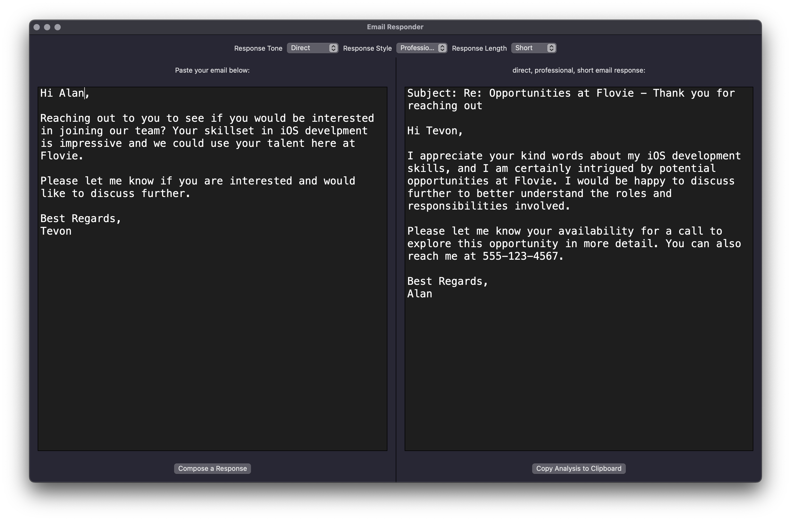
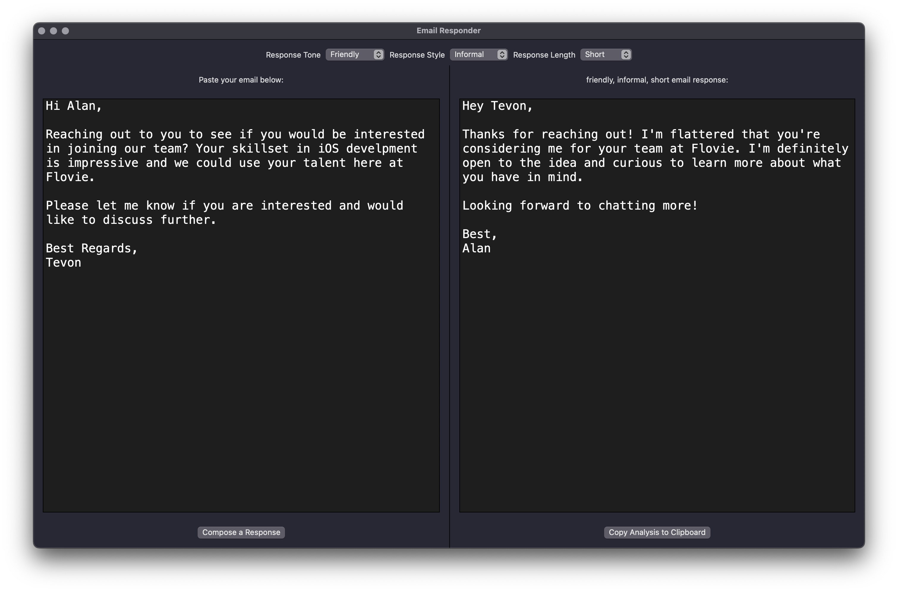
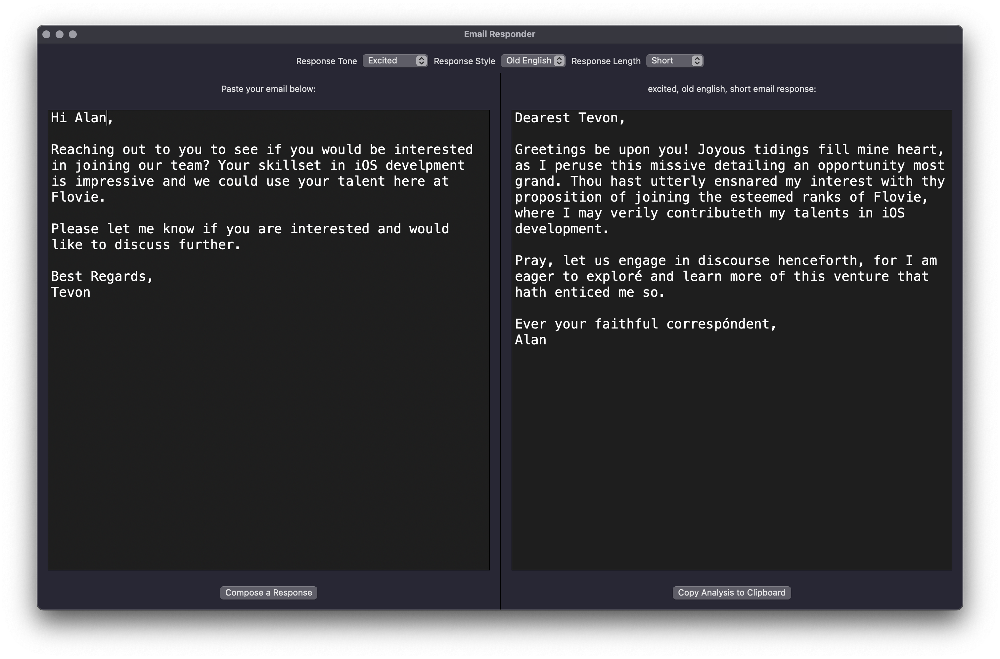

# ChatGPT_EmailResponder
Utilizing the ChatGPT API, this MacOS app composes email responses based on the simple user inputs of ResponseTone, ResponseStyle, and ResponseLength.

**Professional Response**

**Informal Response**

**Old English Response**

